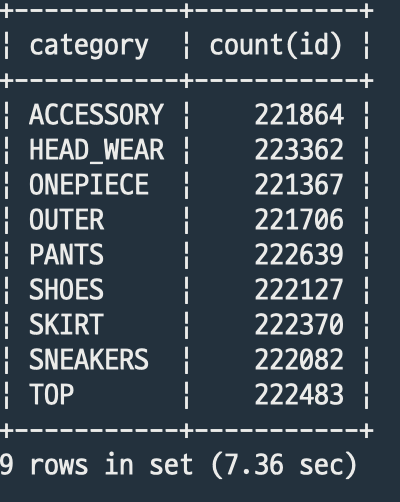
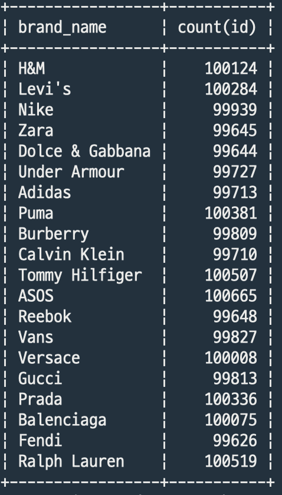
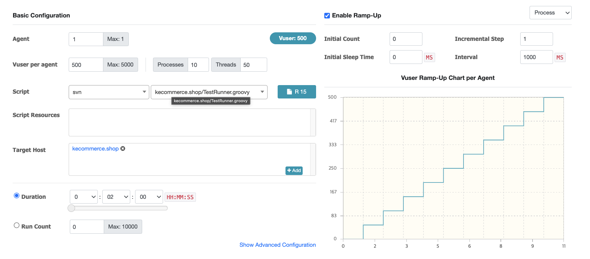
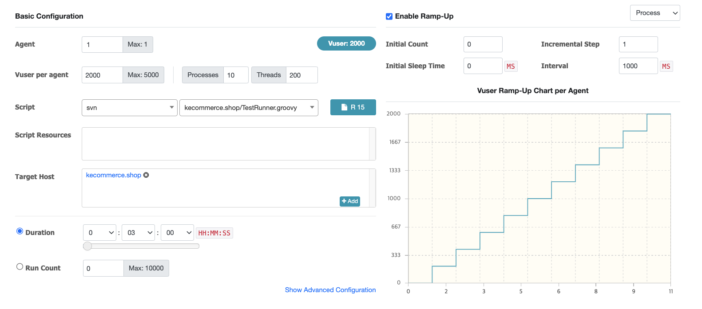
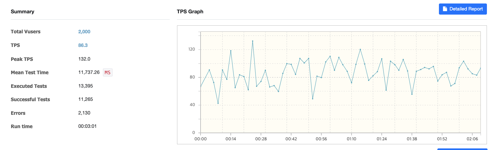
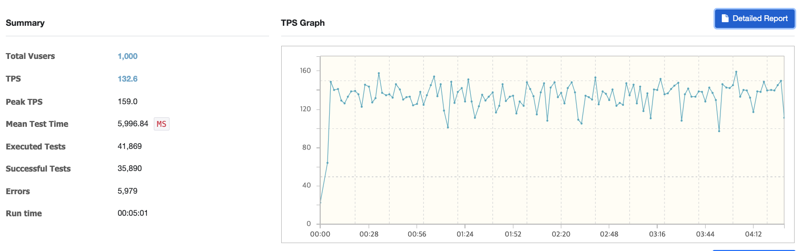
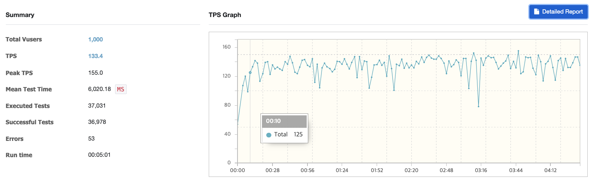

# 성능개선

## **환경**

- EC2 Ubuntu t2.micro(프리티어)  vCPU: 1, RAM: 500MB
- java 11
- RDS mySQL 프리티어
- 상품 약 200만개 기준
- 테스트 도구 : Macbook air M1 , Jmeter

## **시나리오**

### **개요**

- API : 상품 카테고리 검색 /api/categories/{category}
- DB 인덱스 : 클러스터링키 만 존재
- 커넥션풀 ****: HicariCP 기본설정
- 톰캣 NIO : 기본 설정

### **쓰레드 설정**

- 100개
- Ramp-up time 50초
- 루프 2번
- 총 200번의 결과

### **결과**

90% : 28939ms

95% : 31172ms

99% : 56544ms

약 32% 응답 실패 : Connection TimeOut(30000ms)

**Throughput** : 1.8/sec

## 개선

1. 커버링인덱스 생성 

→ id(클러스터링 키), category, created_date desc 인덱스 생성

비지니스 로직 상으로 1차적으로 id 만 조회하기 때문에 해당 인덱스 생성 후 태우기

### **결과**

90% : 48ms

95% : 50ms

99% : 146~333ms

Throughput : 4.0/sec

응답 실패 :0%

### **추가 시나리오**

**쓰레드 그룹 1**

- 3500개
- Ramp-up time 30초
- 루프 2번

**쓰레드 그룹 2**

- 500개
- Ramp-up time 30초
- 반복 1번

### **결과**

90% : 3500ms

95% : 3700ms

99% : 4000ms

## **시나리오**

### **개요**

- API : 상품 카테고리 검색 /api/categories/{category}/detail?page=10
- DB 인덱스 : id, category, created_date 만 존재
- 커넥션풀 ****: HicariCP 기본설정
- 톰캣 NIO : 기본 설정

### **쓰레드 설정**

- 1000개
- Ramp-up time 50초
- 루프 2번
- 총 2000번의 결과

### **결과**

90% : 6800ms

95% : 9400ms

99% : 15200ms

Throughput : 38.1/sec

약 0.6% 응답 실패 : Connection TimeOut(30000ms)

상세 조건 적거나 페이지가 뒤로 갈수록 더 많은 시간이 소요되는 것을 파악

## 개선

1. 커버링인덱스 생성

→ `id`(클러스터링 키), `category`, `price`, `brand_name`, `name`, `created_date desc` 인덱스 생성, `like` 연산자를 고려하여서 `name` 과 `brand_name` 조건 마지막에 놓음

→ 실제 쿼리를 보니 추가로 만든 인덱스를 타지않고 `idx_category_craeted_date` 인덱스를 타는 것을 확인

**원인**

 1. `name` 과 `brand_name` 조건이 `like` 앞쪽이 와일드 카드로 되어있기 때문에 인덱스를 사용하지 못하는데 가장 마지막 조건에 걸어도 데이터가 많으니깐 되게 느리게 처리된다.

1. 범위조건이 인덱스에 포함되어 있으면 뒤에오는 인덱스 컬럼들은 인덱스를 타지못한다.

**개선**

`name`, `brand_name` 조회 정책(`%word%` 에서 `word%`)을 바꾸면 일단 성능이 개선되긴함,

그리고 카테고리 말고는 전부 범위조건인데 범위조건을 사용하면 뒤에 오는 조건은 인덱스를 사용하지 못한다. 따라서 최대한 인덱스를 이용하기 위해 category 를 첫번째 인덱스 컬럼으로 잡고 그 뒤에 카디널리티가 높은 순으로 인덱스를 구성했다.(category, brand_name, created_date desc index 구성)

---

## **ngrinder 를 통한 성능 테스트**

**카테고리별 데이터갯수**

**브랜드별 데이터 갯수**

### **분석방법**

**Ngrinder**, RDS slow query log(1초), 디스코드 알림

### **테스트**

agent : 1

Vuser : 500 (Process : 10 , Threads: 50)

지속시간: 2분

Ramp-Up

Process Interval : 1000ms

**테스트 시나리오**

1차: 랜덤선택된 카테고리와 브랜드명 페이지 번호(최대 15)를 쿼리스트링으로 상세검색 API 요청

2차: 요청된 페이지에서 +1 해서 상세검색 API 요청

**결과**

| TotalVuser | 500 |
| --- | --- |
| TPS | 73.5 |
| PeakTPS | 97.5 |
| Mean Test Time | 3,716ms |
| Executed Tests | 11,565 |
| Successful Tests | 4,276 |
| Errors | 7,289 |

요청 실패원인 :

스프링 서버나 DB 쪽에 문제가 생기면 로그나 디스코드 알림을 통해서 분석을 통해서 문제파악을 하면 될 줄알았는데 별다른 알림없이 에러가 나길래 당황했다. 그러다 잴앞단에 있는 nginx 로그를 살펴보니 워크스레드의 갯수가 부족해서 생기는 문제였다.

문제 해결 :

**worker connection** 768개 → 2000개로 변경

**결과**

| Vuser | 500 |
| --- | --- |
| TPS | 77.8 |
| Peak TPS | 100 |
| Mean Test Time | 5,499ms |
| Executed Tests | 7,652 |
| Successful Tests | 7,652 |
| Errors | 0 |

에러가 없어졌고 TPS가 증가했지만 평균적인 응답시간이 증가

### **추가적으로 Vuser 2000으로 늘려서 테스트**

**결과**

work connection 을 늘렸음에도 스프링서버나 DB에 에러로그가 발생하지않고 응답에 실패한 케이스가 존재했는데 nginx 로그를 보니 `Too many open files` 가 발생했는데 ec2 t2.micro 기본설정으로 524288개로 충분히 큰값으로 되어있다고 생각했는데 해당문제가 생겨서 650000개로 조금 더높은 값으로 설정 했다.

### **추가목표: TPS 와 응답시간 개선**

톰캣을 설정하기 전에 JVM 설정을 확인하고 튜닝하는 이유는 톰캣은 결국 JVM 위에서 동작하고 JVM 성능이  톰캣에 영향을 주기 때문에 JVM 을 우선적으로 튜닝하는 것이 맞지만 아직 JVM 옵션들과 튜닝방법을 잘 모르기 때문에 좀더 알기 쉬운 톰캣설정을 우선적으로 진행해보았다.

1. 톰캣 최대 커넥션, 스레드 변경

톰캣 8.5 이후 부터는 NIO 방식을 기본설정으로 사용하기 때문에 이전보다 스레드를 효율적으로 사용하게 되었다.

최대 생성 가능한스레드의 기본값이 200개에서 300개 정도로 늘리고 최대 요청커넥션 수를 12000 으로 높혔는데 서버의 cpu가 좋은편이 아니고 여러개의 스레드가 생성되면 그만큼 컨택스트 스위칭이 자주발생하기 때문에 비효율적이라고 판단해서 100개만 추가적으로 생성가능하게 했다.

**결과**

(Vuser : 1000, tomcat max Threads 300)

Vuser를 2000개에서 1000개로 줄여서 그런지 응답시간(MTT)도 자연스럽게 줄어들었는데, 초당 테스트 처리수(TPS)가 늘었다. Vuser 와 초당 테스트 처리수가 비례적으로 영향을 주는걸으로 아는데 TPS 가 증가한것으로 보아 기존 2000개를 기준으로 테스트한것이 서버 성능대비 과하지 않았나 생각해본다.

그 외 nginx worker connection 이 부족해서 에러가 발생했는데 기존 2000개에서 2156 바꿔주니 에러가 줄었다.

(nginx work connection 2000 → 2156)

*Vuser 를 1500으로 늘려서 추가적인 테스트를 해보았는데 실패케이스가 많아서 테스트를 정상적으로 확인이 불가능 했다.* 

### **결론과 한계**

ngrinder 로 진행한 테스트는 커버링인덱스를 구성한 상태에서 진행해서 DB I/O 속도의 변화를 체감하는 것은 힘들었던 것같다. 톰캣과 nginx 설정 변경으로 트래픽이 몰렸을 때 생기는 문제 몇가지를 확인하고 해결했지만 서버 튜닝에 이해와 실제 서버에 어느정도 부하가 걸리는지 모니리팅하는 기술에 대해 학습이 부족했고 테스트 서버의 낮은 성능으로 인한 눈에뛰는 변화를 확인하지 못하여 좋은 개선방향을 찾지 못했다. 추후 부족한 부분을 학습하고 서버를 스케일업해서 테스트를 다시한번 진행하고 싶다.