## 사용기술 ##
- Java 11
- Spring Boot 2.7
- JPA
- MySQL
- H2(Local 환경)
----------------------------------------
# Content #
- [Application Architecture](#application-architecture)
- [Flow Chart](#flow-chart)
  * [회원](#회원)
    + [회원가입 요청](#회원가입-요청)
    + [이메일 인증](#이메일-인증)
    + [JWT 토큰](#JWT-토큰)
  * [장바구니](#장바구니)
    + [장바구니 상품등록](#장바구니-상품등록)
    + [장바구니 조회](#장바구니-조회)
  * [상품](#상품)
    + [상품 카테고리 조회](#상품-카테고리-조회)
    + [상품 카테고리별 상세조건 검색 조회](#상품-카테고리별-상세조건-검색-조회)
    + [상품 단건 조회](#상품-단건-조회)
  * [어드민](#어드민)
    + [상품 등록요청](#상품-등록요청)
    + [상품 승인상태 업데이트](#상품-승인상태-업데이트)
    + [등록요청 상품 조회](#등록요청-상품-조회)
- [API](#api)
----------------------------------------
## 요구사항

### 로그인
사용자는 로그인 시 이메일 과 비밀번호를 요청으로 보내면 JWT 인증용 토큰을 응답받 을 수 있다.

### 장바구니

장바구니 API 는 JWT 인증과정을 진행 후 사용 가능하다.

**조회**

- 장바구니 조회 시 해당하는 사용자의 장바구니 가 조회 되야한다.

**상품 담기**

- 상품담기 시 해당하는 상품이 사용자의 장바구니에 담겨 야한다.

**삭제**

- 장바구니 삭제 시 해당하는 상품이 사용자의 장바구니에서 삭제 되어야 한다.

### 검색

검색은 사용자 인증 과정없이 기능 사용이 가능하다.

모든 검색결과는 페이징 기능을 제공한다.

검색결과 정렬기준은 기본적으로 상품이 등록된 등록 순 이다.

**상세검색**
- 상품의 정보들(상품명,브랜드명,등록일자 등)의 기준으로 검색이 가능하다.
- 상품의 정보를 기준으로 오름차순 또는 내림차 순으로 정렬 할 수 있다.

---
## ERD

---

# Application Architecture #

---
# Flow Chart #

## 회원
### 회원가입 요청
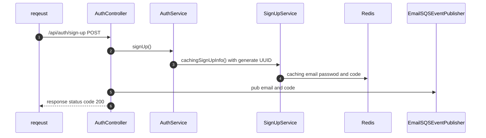

### 이메일 인증
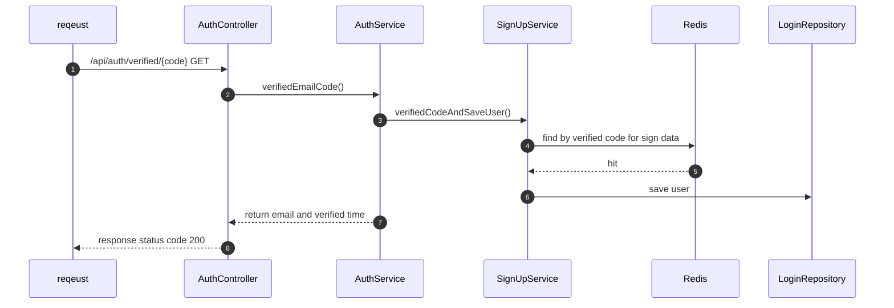

### JWT 토큰
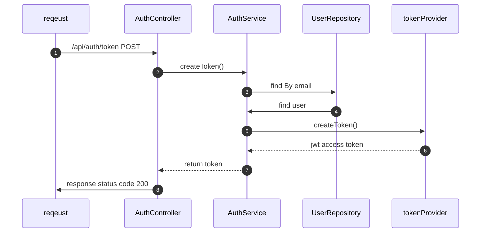
---
## 장바구니
### 장바구니 상품등록
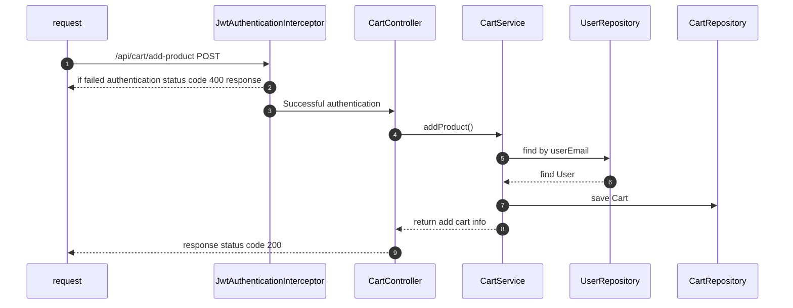

### 장바구니 조회
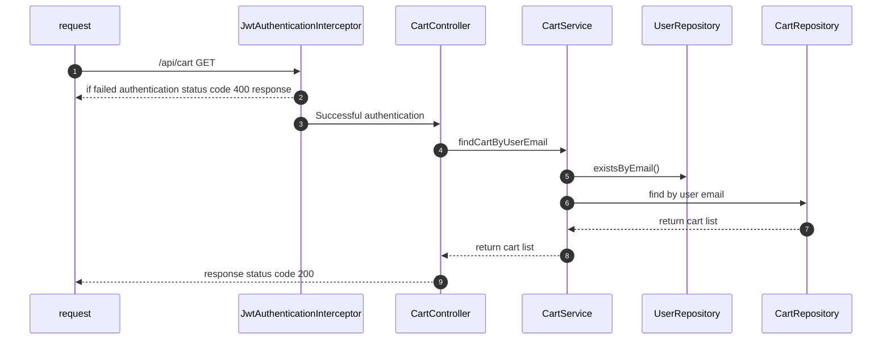
---
## 상품

### 상품 카테고리 조회
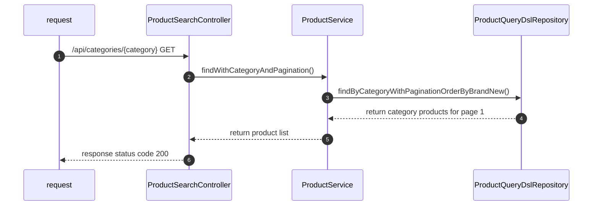

### 상품 카테고리별 상세조건 검색 조회
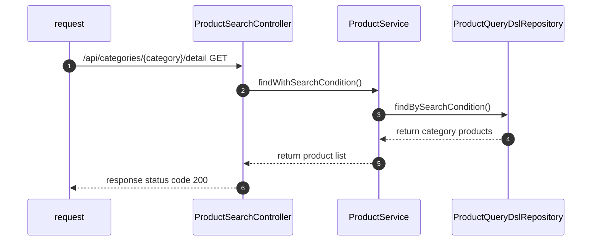

### 상품 단건 조회
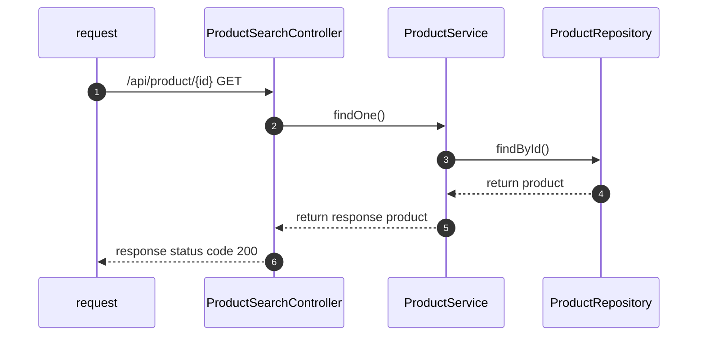
---
## 어드민
### 상품 등록요청
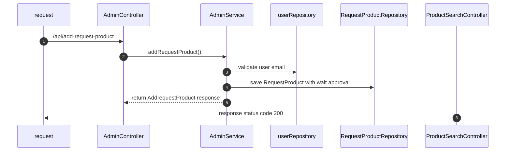

### 상품 승인상태 업데이트
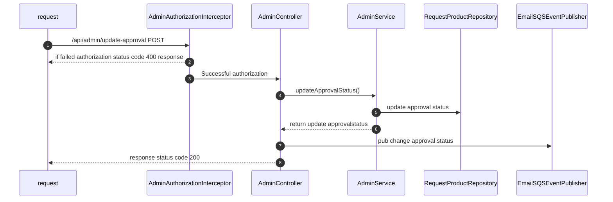

### 등록요청 상품 조회
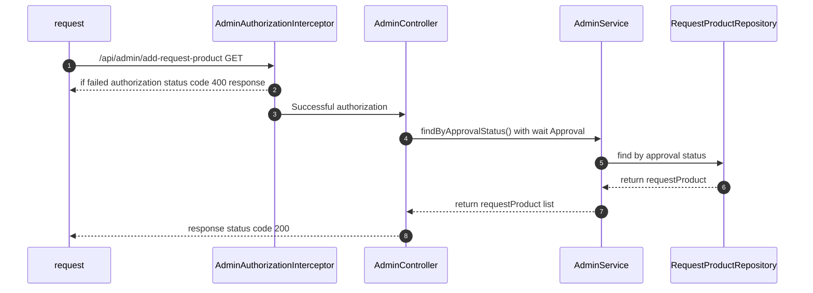
---
