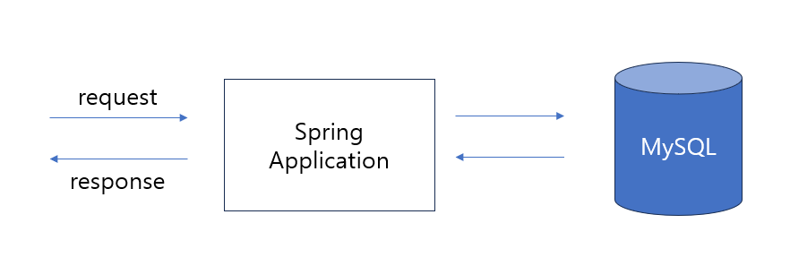

# 제로베이스-커머스 과제

## 요구사항

### 로그인
사용자는 로그인 시 이메일 과 비밀번호를 요청으로 보내면 JWT 인증용 토큰을 응답받
을 수 있다.

### 장바구니

장바구니 API 는 JWT 인증과정을 진행 후 사용 가능하다.

**조회**

- 장바구니 조회 시 해당하는 사용자의 장바구니 가 조회 되야한다.

**상품 담기**

- 상품담기 시 해당하는 상품이 사용자의 장바구니에 담겨 야한다.

**삭제**

- 장바구니 삭제 시 해당하는 상품이 사용자의 장바구니에서 삭제 되어야한다.

### 검색

검색은 사용자 인증 과정없이 기능 사용이 가능하다.

모든 검색결과는 페이징 기능을 제공한다.

검색결과 정렬기준은 기본적으로 상품이 등록된 등록 순 이다.

**상세검색**
- 상품의 정보들(상품명,브랜드명,등록일자 등)의 기준으로 검색이 가능하다.
- 상품의 정보를 기준으로 오름차순 또는 내림차 순으로 정렬 할 수 있다.

---

## ERD

---
## 프로젝트 구조

---
## 사용기술

- Spring
- JPA
- MySQL
- H2(Local 환경)
