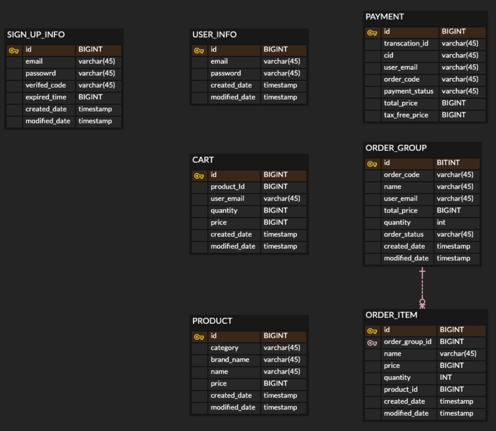

## 사용기술 ##
- Java 11
- Spring Boot 2.7
- JPA
- MySQL
- H2(Local 환경)
----------------------------------------
# Content #
- [Application Architecture](#application-architecture)
- [Flow Chart](#flow-chart)
  * [회원](#회원)
    + [회원가입 요청](#회원가입-요청)
    + [이메일 인증](#이메일-인증)
    + [JWT 토큰 생성](#JWT-토큰-생성)
  * [장바구니](#장바구니)
    + [장바구니 상품등록](#장바구니-상품등록)
    + [장바구니 조회](#장바구니-조회)
  * [상품](#상품)
    + [상품 카테고리 조회](#상품-카테고리-조회)
    + [상품 카테고리별 상세조건 검색 조회](#상품-카테고리별-상세조건-검색-조회)
    + [상품 단건 조회](#상품-단건-조회)
  * [어드민](#어드민)
    + [상품 등록요청](#상품-등록요청)
    + [상품 승인상태 업데이트](#상품-승인상태-업데이트)
    + [등록요청 상품 조회](#등록요청-상품-조회)
- [API](#api)
- - [성능개선](#성능개선)
----------------------------------------
## 요구사항

### 로그인

사용자는 로그인 시 이메일 과 비밀번호를 요청으로 보내면 JWT 인증용 토큰을 응답받 을 수 있다.

사용자는 회원가입 시 이메일 인증을 해야지만 정상적으로 가입이 가능하다.

### 장바구니

장바구니 API 는 JWT 인증과정을 진행 후 사용 가능하다.

**조회**

- 장바구니 조회 시 해당하는 사용자의 장바구니 가 조회 되야한다.

**상품 담기**

- 상품담기 시 해당하는 상품이 사용자의 장바구니에 담겨 야한다.

**삭제**

- 장바구니 삭제 시 해당하는 상품이 사용자의 장바구니에서 삭제 되어야 한다.

### 검색

검색은 사용자 인증 과정없이 기능 사용이 가능하다.

모든 검색결과는 페이징 기능을 제공한다.

검색결과 정렬기준은 기본적으로 상품이 등록된 등록 순 이다.

**상세검색**

- 상품의 정보들(상품명,브랜드명,등록일자 등)의 기준으로 검색이 가능하다.
- 상품의 정보를 기준으로 오름차순 또는 내림차 순으로 정렬 할 수 있다.

### 어드민

- 상품등록 요청 처리는 어드민 계정만 가능하다
    - 상품 승인상태 업데이트시 요청유저의 이메일로 승인결과를 보낸다.

---
## ERD

---

# Application Architecture #


---
# Flow Chart #

## 회원
### 회원가입 요청


### 이메일 인증


### JWT 토큰 생성

---
## 장바구니
### 장바구니 상품등록


### 장바구니 조회

---
## 상품

### 상품 카테고리 조회


### 상품 카테고리별 상세조건 검색 조회


### 상품 단건 조회

---
## 어드민
### 상품 등록요청


### 상품 승인상태 업데이트


### 등록요청 상품 조회

---
# API

### 회원가입 요청 ###

```http
POST /api/auth/sign-up HTTP/1.1
Content-Type: application/json

{
 "email" : "email@email.com",
 "password" : "encriptpassword"
}
```
```http
HTTP/1.1 200 OK
Content-Type: application/json

{
    "message" : "회원가입 요청이 성공적으로 완료되었습니다.",
    "entity": {
        "email": "email@email.com",
        "requestTime": "2023-09-21T19:30:14" /* yyyy-MM-dd'T'HH:mm:ss */
    }
}
```

### 이메일 인증 ###
`code` : 인증코드
```http
GET /api/auth/verified/{code} HTTP/1.1
```
```http
HTTP/1.1 200 OK
Content-Type: application/json

{
    "message" : "이메일 인증이 성공적으로 완료되었습니다.",
    "entity": {
        "email": "email@email.com",
        "requestTime": "2023-09-21T19:30:14" /* yyyy-MM-dd'T'HH:mm:ss */
    }
}
```

### 토큰생성 ###
`CreatedJwt` : 생성된 인증용 JWT
```http
POST /api/auth/verified/{code} HTTP/1.1
Content-Type: application/json

{
 "email : "email@email.com",
 "password" : "encriptPassword"
}
```
```http
HTTP/1.1 200 OK
Content-Type: application/json

{
    "message" : "이메일 인증이 성공적으로 완료되었습니다.",
    "entity": {
        "accessToken": "{CreatedJwt}",
        "expireTime": "30000000" /** per milis **/,
        "type" : "Bearer "
    }
}
```

### 장바구니 상품등록 ###
`accessToken` : 인증용 JWT
```http
POST /api/cart/add-product HTTP/1.1
Content-Type: application/json
Authorization: Bearer {accessToken}

{
 "email : "email@email.com",
 "productId" : 15253,
 "quantity" : 2
}
```
```http
HTTP/1.1 200 OK
Content-Type: application/json

{
    "message" : "장바구니에 상품이 추가 되었습니다.",
    "entity": {
        "id": 15253,
        "quantity": 2,
        "price": 360000 /* 등록한 상품의 갯수의 총합 */
    }
}
```

### 장바구니 조회 ###
`accessToken` : 인증용 JWT
```http
GET /api/cart HTTP/1.1
Authorization: Bearer {accessToken}
```
```http
HTTP/1.1 200 OK
Content-Type: application/json

{
  "message": "장바구니가 성공적으로 조회 되었습니다.",
  "entity": {
    "email": "email@email.com",
    "products": {
      "count": 3,
      "totalPrice": 135000,
      "value": [
        {
          "id": 1,
          "name": "Product1",
          "brandName": "나이키",
          "price": 45000,
          "category": "TOP",
          "quantity": 1
        },/* 조회된 장바구니 상품 */
      ]
    }
  }
}
```

### 상품 카테고리별 조회 ###
`category` : 상품 카테고리
```http
GET /categories/{category} HTTP/1.1
```
```http
HTTP/1.1 200 OK
Content-Type: application/json

{
  "message": "상품이 성공적으로 조회 되었습니다.",
  "entity": {
    "totalCount": 20,
    "products": [
      {
        "id": 1,
        "name": "Product1",
        "brandName": "나이키",
        "price": 45000,
        "category": "TOP"
      },/* 조회된 상품 */
    ]
  }
}
```

### 상품 카테고리별 상세조건 조회
#### Query Parameters ####
- `name` : 상품 이름
- `brandName` : 브랜드 이름
- `minPrice` : 최소 가격
- `maxPrice` : 최대 가격
- `sort` : 정렬 조건 (`new` , `price_low`, `price_high`)
- `page` : 페이지 번호
- `page` 를 제외한 조건들은 `null` 이 가능하다. 한 페이지당 **20개**의 데이터를 조회한다.

```http
GET /categories/PANTS/detail HTTP/1.1
```
```http
HTTP/1.1 200 OK
Content-Type: application/json

{
  "message": "상품이 성공적으로 조회 되었습니다.",
  "entity": {
    "totalCount": 20,
    "products": [
      {
        "id": 150,
        "name": "청바지",
        "brandName": "모드나인",
        "price": 95000,
        "category": "PANTS"
      },/* 조회된 상품 */
    ]
  }
}
```

### 상품 단건 조회 ###
`id` : 상품 아이디
```http
GET /product/{id} HTTP/1.1
```
```http
HTTP/1.1 200 OK
Content-Type: application/json

{
  "message": "상품이 성공적으로 조회 되었습니다.",
  "entity": {
    "id": 150,
    "name": "청바지",
    "brandName": "모드나인",
    "price": 95000,
    "category": "PANTS"
  }
}
```

## 에러 Case ##
### 인증과정 ###
```http
HTTP/1.1 400 BAD REQEUST
Content-Type: application/json

{
  "message": "인증과정에서 문제가 발생 하였습니다.",
  "reasons": {
    "authHeader": "인증 헤더타입이 일치하지 않습니다." /* 하나 이상의 발생 이유 */
  }
}
```
### 일반적인 에러 ###
```http
HTTP/1.1 400 BAD REQEUST
Content-Type: application/json

{
  "message": "잘못된 요청입니다.",
  "reasons": {
    "product": "해당하는 상품이 존재하지 않습니다." /* 하나 이상의 발생 이유 */
  }
}
```
자세한 상황별 예외는 [**ErrorCode**](./src/main/java/back/ecommerce/exception/ErrorCode.java) 를 참조하세요.

# 성능개선

## **환경**

- EC2 Ubuntu t2.micro(프리티어)  vCPU: 1, RAM: 500MB
- java 11
- RDS mySQL 프리티어
- 상품 약 200만개 기준
- 테스트 도구 : Macbook air M1 , Jmeter

## **시나리오**

### **개요**

- API : 상품 카테고리 검색 /api/categories/{category}
- DB 인덱스 : 클러스터링키 만 존재
- 커넥션풀 ****: HicariCP 기본설정
- 톰캣 NIO : 기본 설정

### **쓰레드 설정**

- 100개
- Ramp-up time 50초
- 루프 2번
- 총 200번의 결과

### **결과**

90% : 28939ms

95% : 31172ms

99% : 56544ms

약 32% 응답 실패 : Connection TimeOut(30000ms)

**Throughput** : 1.8/sec

# 개선 #

1. 커버링인덱스 생성 

→ id(클러스터링 키), category, created_date desc 인덱스 생성

비지니스 로직 상으로 1차적으로 id 만 조회하기 때문에 해당 인덱스 생성 후 태우기

### **결과**

90% : 48ms

95% : 50ms

99% : 146~333ms

Throughput : 4.0/sec

응답 실패 :0%

### **추가 시나리오**

**쓰레드 그룹 1**

- 3500개
- Ramp-up time 30초
- 루프 2번

**쓰레드 그룹 2**

- 500개
- Ramp-up time 30초
- 반복 1번

### **결과**

90% : 3500ms

95% : 3700ms

99% : 4000ms
